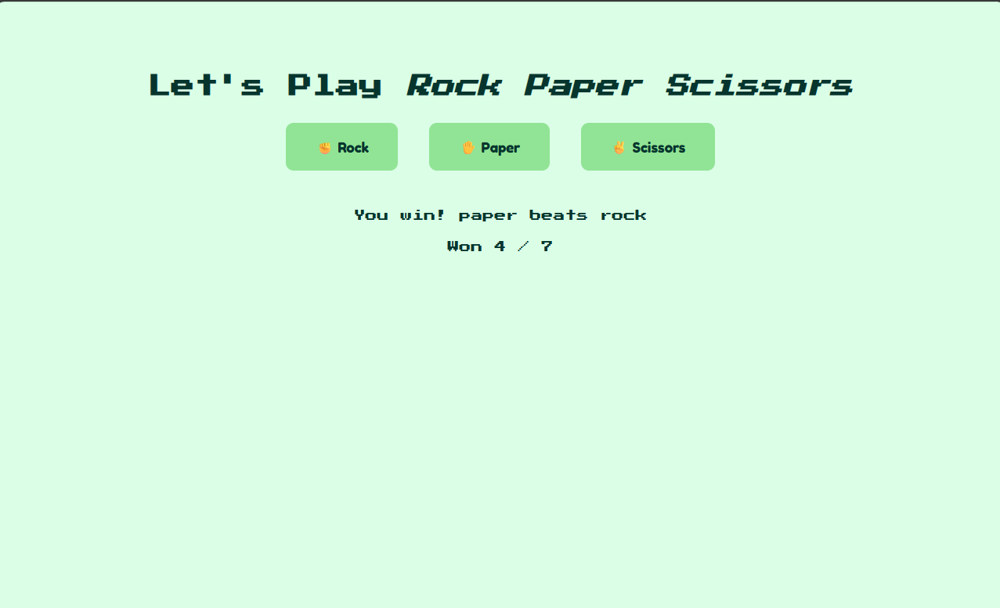

# ✊✋✌️ Rock Paper Scissors – Web Game

A quick and fun web-based **Rock Paper Scissors** game! Play against the computer and see how many times you can win. 

---

## 🎮 How to Play

Click one of the buttons:

- ✊ Rock  
- ✋ Paper  
- ✌️ Scissors  

The computer randomly picks a move. The game instantly tells you who won and updates your win count!

---

## Features

- Random computer choice  
- Tracks your wins and total rounds  
- Clean, responsive UI with colorful buttons  
- Instant feedback after every round  

---

## Files

- `index.html` – Main HTML page with buttons and display area  
- `style.css` – Simple and clean styles for the game  
- `script.js` – Game logic and counter tracking  

---

## To Run It

1. Clone or download this project.  
2. Open `index.html` in your browser.  
3. Start playing and try to beat the machine! 🧠🤖  

---

## 

Want to make it cooler?

- Add sounds or animations 🎵 
- Show win percentages 📊  
- Add a reset score button 🔁  

---

## Screenshot

